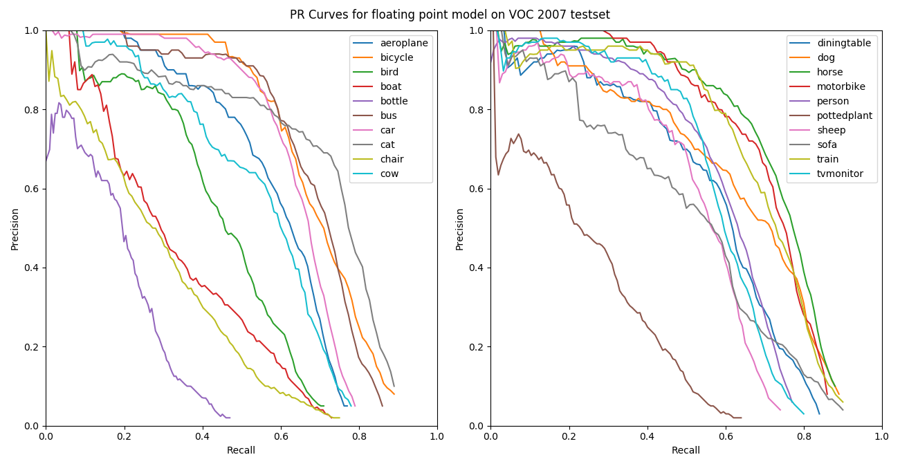
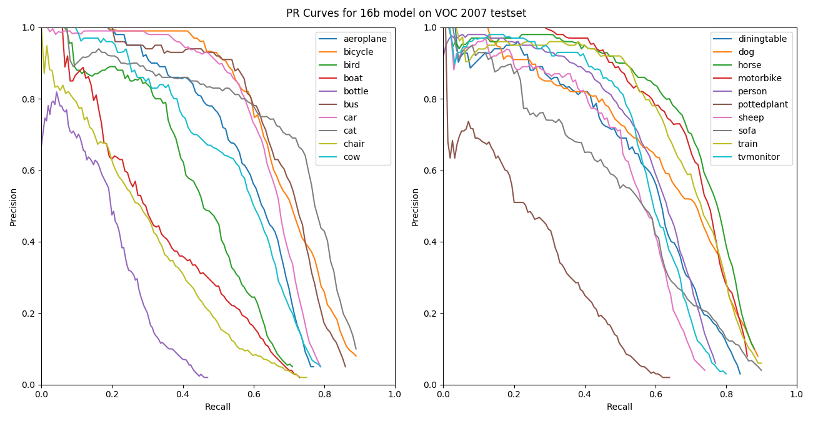
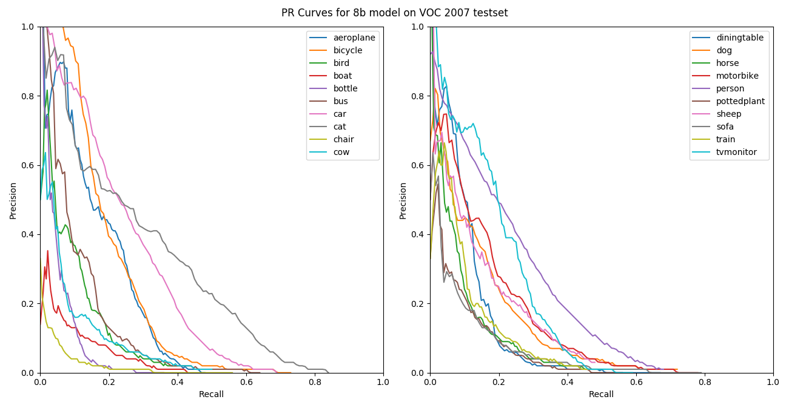

# Low Precision Extension to Darknet

This extension to the Darknet framework aims at providing low precision inference for Darknet models. Currently the underlaying arithmetic is still in floating point. However, the model file can be stored using 8b or 16b format which helps to reduce the model size by a factor of 4 or 2 respectively. Initial goal is to save some space on SD card when using on embedded platforms and mobile devices.

# Evaluation

I have evaluated the effect of model quantization on detector performance. The evaluation is using **Tiny-YOLO** on PASCAL VOC 2007 test set. The original floating point model is from [here](https://pjreddie.com/media/files/tiny-yolo-voc.weights).

The 16 bit model has similar or slightly better performance compared to the full precision floating point model. However, 8 bit model representation hurts the accuracy very much as can be seen from the PR curves below.

The precision and recall values are below.

| Class       | AP (float) | Recall (float) | AP (16bit) | Recall (16bit) | AP (8bit) | Recall (8bit) |
| ----------- | ---------- | -------------- | ---------- | -------------- | --------- | ------------- |
| aeroplane   | 0.59       | 0.77           | 0.59       | 0.77           | 0.18      | 0.48          |
| bicycle     | 0.7        | 0.89           | 0.7        | 0.89           | 0.21      | 0.73          |
| bird        | 0.45       | 0.71           | 0.45       | 0.71           | 0.09      | 0.4           |
| boat        | 0.34       | 0.73           | 0.34       | 0.73           | 0.04      | 0.43          |
| bottle      | 0.19       | 0.47           | 0.19       | 0.47           | 0.05      | 0.36          |
| bus         | 0.68       | 0.86           | 0.69       | 0.86           | 0.11      | 0.64          |
| car         | 0.65       | 0.79           | 0.65       | 0.79           | 0.25      | 0.69          |
| cat         | 0.69       | 0.89           | 0.69       | 0.89           | 0.29      | 0.84          |
| chair       | 0.29       | 0.75           | 0.29       | 0.75           | 0.02      | 0.56          |
| cow         | 0.55       | 0.78           | 0.55       | 0.79           | 0.07      | 0.5           |
| diningtable | 0.57       | 0.84           | 0.57       | 0.84           | 0.12      | 0.67          |
| dog         | 0.63       | 0.89           | 0.63       | 0.89           | 0.13      | 0.72          |
| horse       | 0.73       | 0.88           | 0.73       | 0.88           | 0.08      | 0.52          |
| motorbike   | 0.71       | 0.86           | 0.71       | 0.86           | 0.15      | 0.78          |
| person      | 0.59       | 0.77           | 0.59       | 0.77           | 0.22      | 0.68          |
| pottedplant | 0.25       | 0.64           | 0.25       | 0.64           | 0.06      | 0.56          |
| sheep       | 0.52       | 0.74           | 0.52       | 0.74           | 0.13      | 0.48          |
| sofa        | 0.51       | 0.9            | 0.51       | 0.9            | 0.07      | 0.79          |
| train       | 0.69       | 0.9            | 0.69       | 0.9            | 0.09      | 0.51          |
| tvmonitor   | 0.58       | 0.8            | 0.58       | 0.8            | 0.2       | 0.59          |
| **Mean**    | **0.55**   | **0.79**       | **0.55**   | **0.79**       | **0.13**  | **0.60**      |

# TODO

1. On the fly weight conversion from 8b to float during the floating point inference so that RAM usage can be reduced.
2. Memory and runtime measurement hooks.
3. Computations using 8b/16bit.