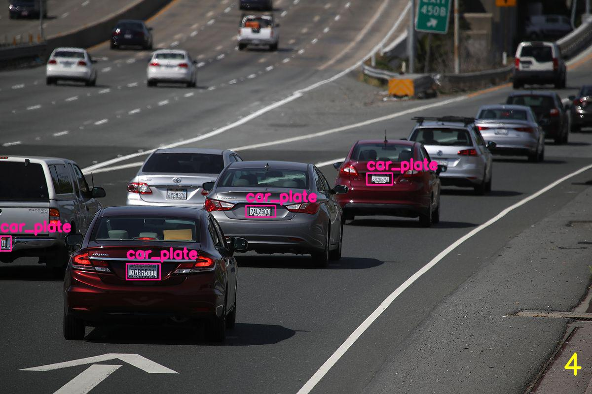
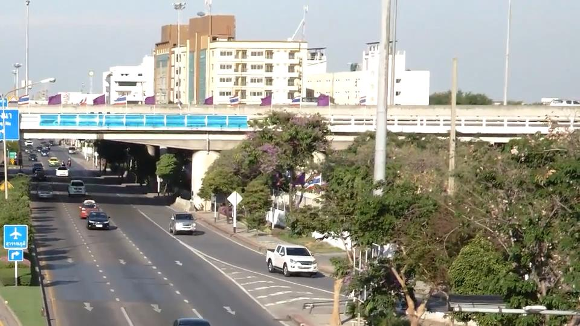
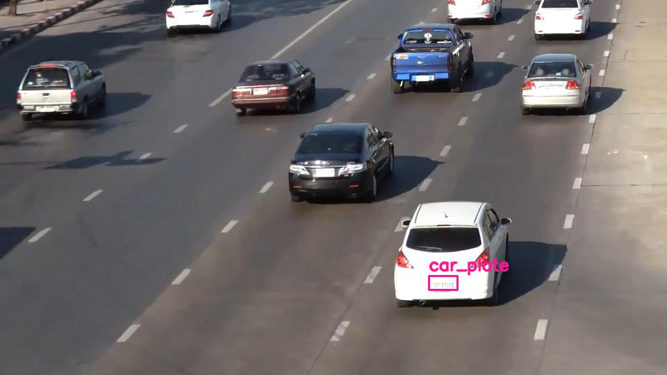
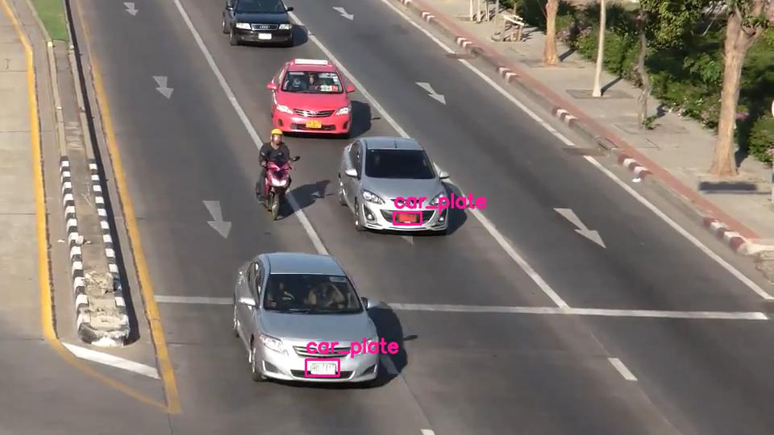
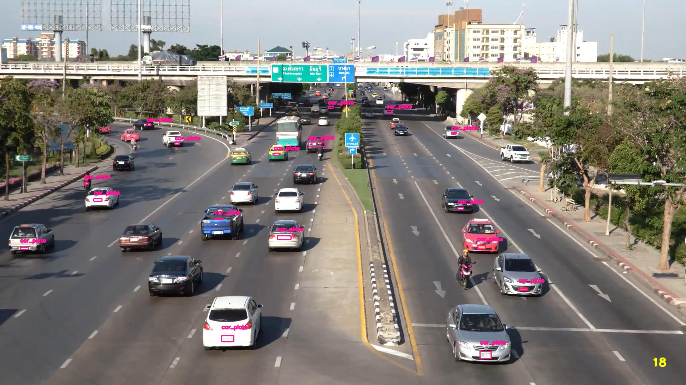

# Darknet Python Wrapper
## setup
    sh setup.sh
###### you might want to change the Makefile
    cd ../
    make

## predict.py
#### predict a given image and display output.
    python3 predict.py <ini_file> <image> <output_file_path>

## predict_one.py
#### split an image into 4 slices and predict on each image, then merge back to one. output will be store in output and 4 slices will be store in temp
    python3 predict_one.py <ini_file> <image>
#### predict slices
Position (0,0)             |  Position (0,1)
:-------------------------:|:-------------------------:
 | 
Position (1,0)              |  Position (1,1)
 | 

#### merge predicted slices

## predict_silding_windows.py
    python3 predict_tiling.py <ini_file> <image>
#### image tiling (Avoid resizing)
#### when dealing with big images, darknet will resize the image into the network input size; this process downsample the image and might even change the aspect ratio which will destroy features.
#### For image tiling, we simply have a small window that have the same size as the network input size, slice through the entire image and predict on every single slice.

